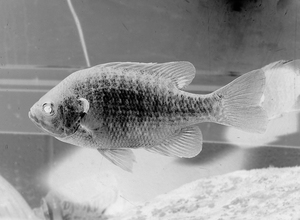
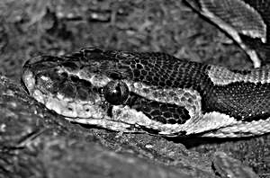

# Pset1 - MIT:
---
### *Professor: Abrantes Araujo Silva Filho*
### *Aluno: Tales Paiva Calvi*
### *Matrícula: 202305903*
### Pset é um trabalho passado para os alunos do Curso de Ciências da Computação, este no caso, faz parte da disciplina Linguagens de Programação e é um trabalho original adaptado do MIT, o PSET1 MIT 6.009.
---
## Questão 1:
### Para saber o resultado, é necessário subtrair o valor 255 pelo valor de cada pixel, dessa forma:
#### 1° pixel: 255 - 29 = 226
#### 2° pixel: 255 - 89 = 166
#### 3° pixel: 255 - 136 = 119
#### 4° pixel: 255 - 200 = 55

### Logo o output seria uma imagem com os pixels iguais a [255, 166, 119, 55]
---
## Questão 2:
### A imagem solicitada com o filtro de inversão está exibida abaixo:

---
## Questão 3:
#### 0.00 -0.07 0.00       
#### -0.45 1.20 -0.25
#### 0.00 -0.12 0.00
#### Aplicando correlação desse kernel à:
| 80  | 53  | 99  |
| --- | --- | --- |
| 129 | 127 | 148 |
| 176 | 174 | 193 |
### Cálculo:
#### (0.00 * 80) + (-0.07 * 53) + (0.00 * 99) + (-0.45 * 129) + (1.20 * 127) + (-0.25 * 148) + (0.00 * 175) + (-0.12 * 174) + (0.00 * 193) =
#### 0 + (-3.71) + 0 + (-58.05) + 152.4 + (-37) + 0 + (-20.88) + 0 = 32.76
### Logo, o valor do pixel central é aproximadamente 32.76.
---
## Questão 4:
### A imagem solicitada com o o kernel aplicado está exibida abaixo:

---
## Questão 5:
#### Para responder essa pergunta será usado de exemplo o seguinte kernel:
| 1 | 2 | 3 |
| - | - | - |
| 4 | 5 | 6 |
| 7 | 8 | 9 |
#### Aplicando esse kernel a formula Sx,y = round(2Ix,y - Bx,y) levará ao seguinte cálculo:

#### Sx,y = round(2*(Ix-1, y-1) * 1 + (Ixx, y-1) * 2 + (Ix+1, y-1) * 3 + (Ix-1, y) * 4 + (Ix, y) * 5 + (Ix+1, y) * 6 + (Ix-1, y+1) * 7 + (Ix, y+1) * 8 + (Ix+1, y+1) * 9 ) - Bx,y

---
## Questão 6:
#### Ambos os kernels são responsáveis por detectar bordas na imagem, sendo o kernel Kx responsável por detectar variações horizontais e o kernel Ky responsável por detectar variações verticais. O uso dos dois juntos é capaz de detectar bordas em ambas direções.
### Imagem gerada com o uso desses kernels:

---

